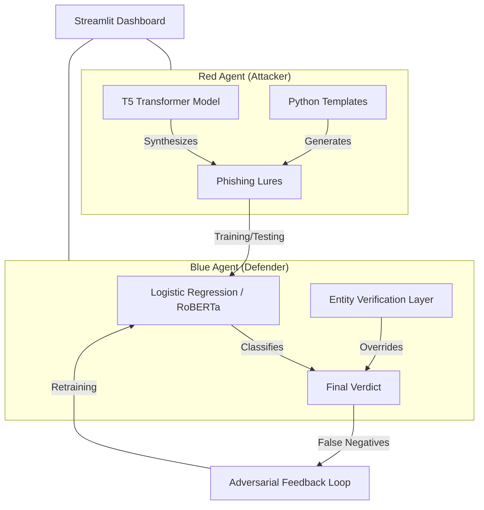

# AI²-SED: Adversarial Intelligence Simulated Evolutionary Defense

[](https://www.python.org/downloads/release/python-390/)
[](https://streamlit.io/)
[](https://scikit-learn.org/)
[](https://huggingface.co/docs/transformers/model_doc/t5)

**AI²-SED** is a cutting-edge security simulation platform designed to build next-generation phishing defenses through **Adversarial Co-Evolution**. By pitting a generative AI "Attacker" against an NLP-driven "Defender," the system creates a continuous learning loop that evolves in real-time to catch increasingly sophisticated cyber threats.

---

## 🚀 The Vision: Co-Evolutionary Defense

Traditional email firewalls are static. **AI²-SED** is alive. Our project demonstrates a "Sparring Match" architecture where:
1.  **The Red Agent (Attacker)** uses a T5 Transformer model to synthesize novel, highly-realistic phishing lures.
2.  **The Blue Agent (Defender)** uses statistical NLP and Deep Learning to intercept those attacks.
3.  **The Feedback Loop** identifies the Blue Agent's failures, appends them to its training corpus, and triggers an automated retraining cycle—literally evolving the defense to counter the latest tactics.

---

## ✨ Key Features

### 🛡️ Real-Time "Shield" Dashboard
A live interactive tool where users can verify suspicious messages. It combines:
*   **Stochastic Analysis:** ML-based language pattern scoring.
*   **Deterministic Validation:** A custom **Entity Verification Layer** that uses Regex-based URL parsing and a whitelisting system to override ML errors for trusted domains (e.g., Microsoft, Comcast, Workday).

### 👹 The Red Agent Lab
A generative suite for synthesizing attacks across multiple delivery channels (Email and SMS):
*   **Template Engine:** Rapid generation of structured, parameter-based lures.
*   **T5 Synthesis:** Dynamic text generation using specialized Transformer models from HuggingFace.

### 🔄 Automated Adversarial Rounds
Execute automated "Sparring Matches" directly from the UI.
*   Monitor the **DEI (Defensive Effectiveness Index)** in real-time.
*   Trigger **One-Click Retraining** to patch the Defender's weaknesses based on recent failures.

### 📊 Advanced Analytics Suite
Track the "Evolutionary Timeline" of your agents through:
*   **Confusion Matrices** for granular error analysis.
*   **History Charts** visualizing performance trends over dozens of sparring rounds.
*   **Executive Dashboards** providing a high-level view of multi-channel vulnerabilities.

---

## 🏗️ Technical Architecture



---

## 🛠️ Technology Stack

*   **Frontend:** [Streamlit](https://streamlit.io/) (Stateful Python Web App)
*   **NLP Engines:** [Scikit-learn](https://scikit-learn.org/), [HuggingFace Transformers](https://huggingface.co/docs/transformers/index) (T5, RoBERTa)
*   **Data Processing:** [Pandas](https://pandas.pydata.org/), [NumPy](https://numpy.org/)
*   **Visualization:** [Altair](https://altair-viz.github.io/), [Matplotlib](https://matplotlib.org/)
*   **DevOps:** [Git](https://git-scm.com/) (Versioned Datasets and Models)

---

## 🏁 Quickstart

### 1. Prerequisites
Ensure you have Python 3.9+ installed on your machine.

### 2. Setup Environment
```bash
# Create and activate virtual environment
python -m venv .venv
source .venv/bin/activate  # Windows: .venv\Scripts\activate

# Install dependencies
pip install -r requirements.txt
```

### 3. Initialize Agents (Optional)
```bash
# Generate seed attack data
python red_agent/generate_seed.py

# Train initial baseline defender
python blue_agent/train_baseline.py --input data/processed/seed_dataset.csv --model_out blue_agent/models/baseline.joblib
```

### 4. Launch the Dashboard
```bash
streamlit run app/app.py
```

---

## 📅 Future Roadmap

*   [ ] **WHOIS Integration:** Real-time domain-age verification for the Entity Layer.
*   [ ] **Smishing Optimization:** Specialized T5 fine-tuning for ultra-succinct SMS attacks.
*   [ ] **Explainable AI (XAI):** UI-integrated word highlighting to visualize "Why" the AI flagged a message.
*   [ ] **Federated Learning:** Shared attack-signature intelligence across distributed nodes.

---

## 👨‍💻 Author
**Project Lead:** [Your Name]
**Project Status:** Midterm Build (75% Complete)

*Built with ❤️ to secure the human element in cybersecurity.*